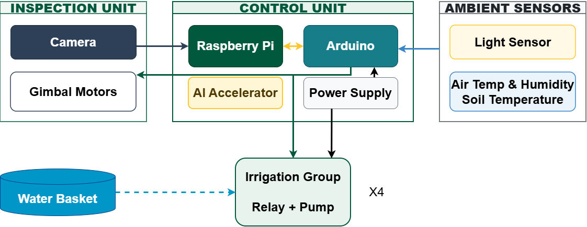

# CEA Irrigation System

An AI-powered automated irrigation system for **Controlled Environment Agriculture (CEA)**, built on Raspberry Pi 5 with Google Coral Edge TPU acceleration. The system monitors soil moisture, temperature, humidity, and light in real time, drives up to 4 independent pump channels, and provides a desktop GUI with live camera feed and AI-powered plant health detection.



---

## Features

- **4 independent irrigation channels** — per-channel soil moisture sensing and pump relay control
- **AI plant health monitoring** — YOLO inference on Google Coral USB TPU via a pan-tilt camera gimbal
- **Auto & manual watering modes** — moisture-setpoint-based auto-loop and one-click manual control
- **Scheduled daily watering** — configurable 10 AM trigger with per-channel target cutoff (default 80%)
- **Real-time telemetry** — soil moisture, soil/air temperature, humidity, and ambient light
- **Historical data plots** — day / week / month views with water volume tracking per pump
- **Remote access** — Tailscale VPN for SSH and dashboard access from anywhere
- **Comprehensive tests** — `pytest` suite covering auto-loop, scheduler, plot, and logger logic

---

## Hardware Requirements

| Component                  | Part / SKU                                 | Notes                                                      |
| -------------------------- | ------------------------------------------ | ---------------------------------------------------------- |
| Raspberry Pi 5             |                                            | Main compute controller                                    |
| Arduino (Uno/Mega)         |                                            | Serial sensor & relay bridge via USB                       |
| Soil Moisture Sensor ×4   | Generic analog capacitive                  | Wired to Arduino analog pins A0–A3                        |
| Air Temp & Humidity Sensor | **DHT22**                            | Arduino digital pin 7                                      |
| Soil Temperature Sensor    | **DS18S20 / DS18B20**                | OneWire, Arduino digital pin 8                             |
| Ambient Light Sensor       | **DFRobot SEN0228** (VEML7700, I²C) | [GitHub](https://github.com/DFRobot/DFRobot_VEML7700)       |
| IO Expansion Shield        | **DFRobot DFR0265**                  | [Wiring guide](https://wiki.dfrobot.com/dfr0265/docs/22453) |
| Relay Module ×4           | Any 4-channel 5 V relay                    | Arduino digital pins 2–5                                  |
| Submersible Water Pump ×4 | —                                         | One per irrigation channel                                 |
| Google Coral USB TPU       | Coral USB Accelerator                      | AI inference accelerator (optional)                        |
| Camera Module              | ArduCam / Raspberry Pi Camera              | Mounted on pan-tilt gimbal                                 |
| Pan-Tilt Servos            | 2× standard servo                         | Arduino pins 9 (pan), 10 (tilt)                            |

---

## Project Structure

```
cea_irrigation/
├── firmware/
│   ├── controller/          # Arduino production firmware
│   ├── hardware_tests/      # Per-sensor Arduino test sketches
│   └── libraries/           # Arduino C++ libraries (DHT, OneWire, DFRobot_VEML7700)
├── gui/                     # Desktop GUI application & vision modules
│   └── models/              # TFLite model (yolo26n_e100.tflite)
├── scripts/                 # CLI controller
├── tests/                   # pytest suite
├── docs/                    # Diagrams for README
├── setup.sh                 # One-shot setup script
└── pyproject.toml
```

---

## Software Requirements

- Raspberry Pi OS **Bookworm** 64-bit (recommended)
- Arduino IDE (for flashing firmware)
- Python **3.13+**
- `uv` (Python package manager — installed automatically by `setup.sh`)
- Google Coral USB TPU driver (`libedgetpu1-std`) — installed by `setup.sh`

## Quick Setup (Raspberry Pi 5)

```bash
git clone https://github.com/gabe-zhang/cea_irrigation.git
cd cea_irrigation
bash setup.sh
```

> **Reboot required** after setup for the USB3 max current setting to take effect.

---

## Usage

### Run the GUI

```bash
uv run --extra gui python -m gui.psc_irr_gui
```

### Run the CLI controller (serial only, no GUI)

```bash
uv run python scripts/controller.py
```

---

## Firmware

Flash the production firmware to your Arduino:

1. Open **Arduino IDE**
2. Load `firmware/controller/controller.ino`
3. Install libraries (already copied to `~/Arduino/libraries/` by `setup.sh`):
   - `DHT` (DHT22 air sensor)
   - `OneWire` (DS18S20 soil temp)
   - `DFRobot_VEML7700` (ambient light)
4. Select your board and port, then upload

Hardware test sketches are available in `firmware/hardware_tests/` for validating each sensor individually.

---


## Troubleshooting

**Coral TPU not detected**

```bash
lsusb | grep Google   # should show "Google Inc. Coral USB Accelerator"
ls /dev/bus/usb/      # verify device node exists
```

Make sure `usb_max_current_enable=1` is in `/boot/firmware/config.txt` and you have **rebooted**. Also confirm your user is in the `plugdev` group (`groups $USER`).

**Serial port not found (`/dev/ttyACM0`)**

```bash
ls /dev/ttyACM*
sudo usermod -aG dialout $USER   # then log out and back in
```

**Camera not initializing**

```bash
libcamera-hello --list-cameras   # verify camera is detected
# Ensure picamera2 is installed (system package, not pip):
sudo apt install python3-picamera2
```

**Tailscale re-authentication**

```bash
sudo tailscale up
```

**uv command not found after setup**

```bash
source ~/.local/bin/env
# or add to ~/.bashrc:
export PATH="$HOME/.local/bin:$PATH"
```

---

## Authors

James Y. Kim (USDA-ARS) · Yuan Zhang

---

*Note: `gui/psc_irr_gui.py` carries a USDA-ARS proprietary notice. Licensing terms will be updated in a future release.*
